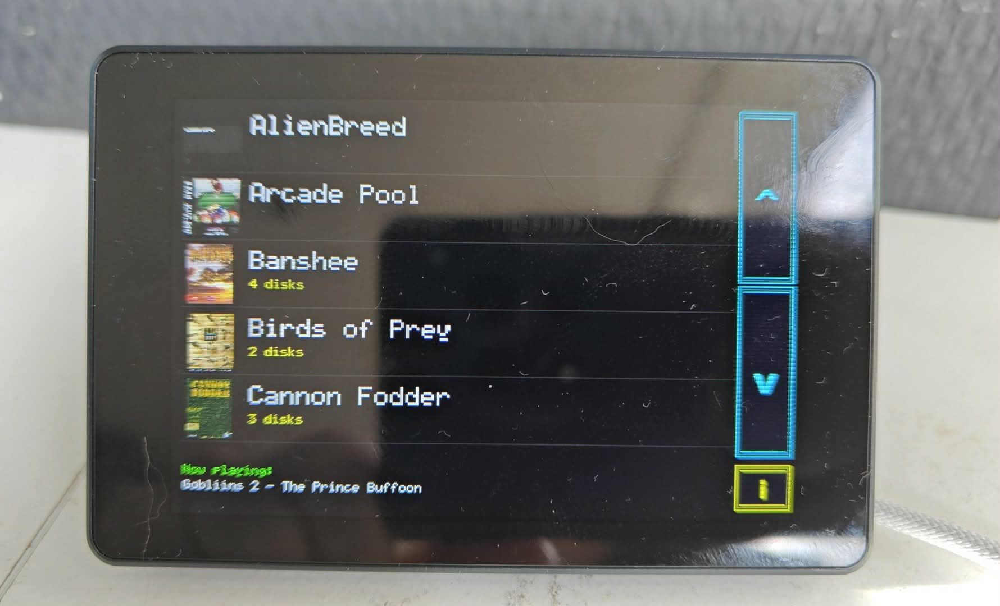
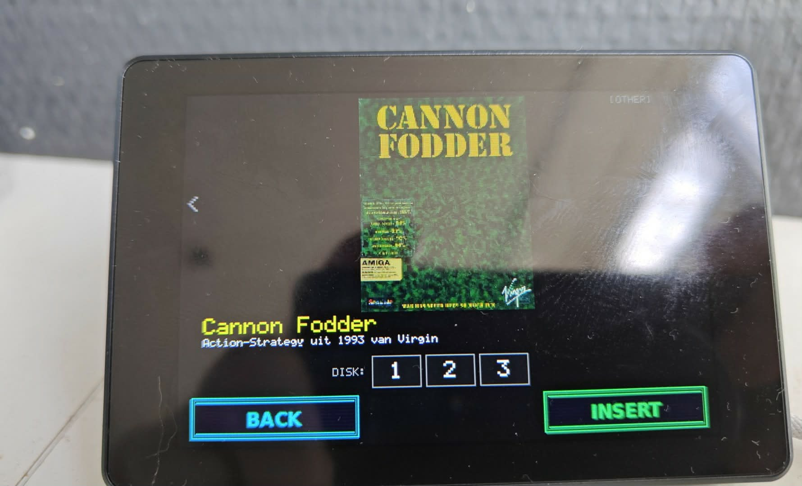
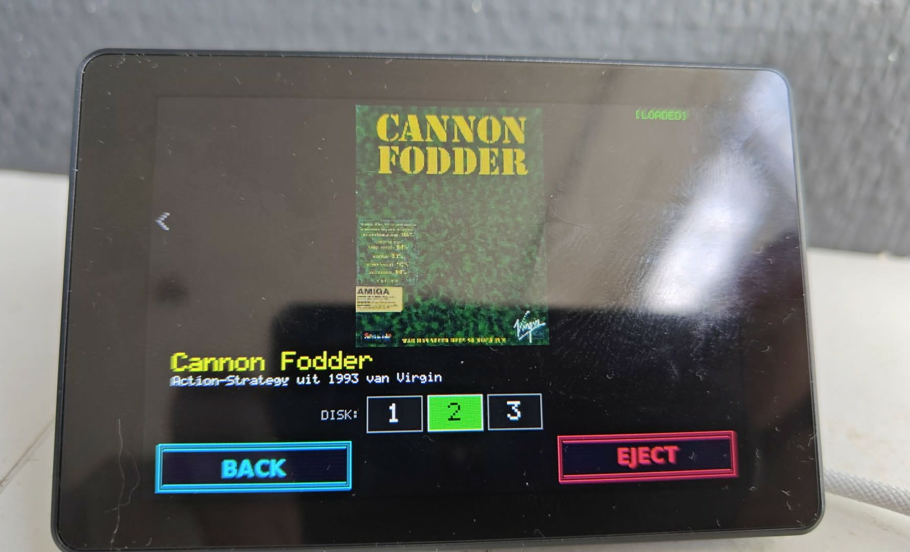
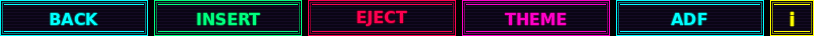
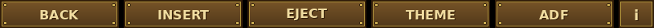

# Gotek Touchscreen Interface

A touchscreen-driven disk image browser for retro computing. Load Amiga ADF and ZX Spectrum/Amstrad CPC DSK files from an SD card onto a USB-presentable RAM drive — with cover art, game info, multi-disk support, and themeable UI.

## Project Variants

This repository contains two firmware variants built from a shared codebase:

| Variant | Description | Branch | Folder |
|---------|-------------|--------|--------|
| **Touchscreen** | Standalone touchscreen display with WiFi web UI | `main` | `Gotek_Touchscreen/` |
| **WiFi Dongle** | Headless USB stick — phone/laptop only control via WiFi | `wifi-dongle` | `Gotek_WiFi_Dongle/` |

The **Touchscreen** version is a standalone unit with a 2.8"–3.5" display that connects to your Gotek via USB. It can also serve as a **wireless remote** for the WiFi Dongle — browse your SD card game library on the touchscreen and send disk images wirelessly to the dongle.

The **WiFi Dongle** is a tiny ESP32-S3 board (Seeed XIAO, 21×17.5mm) that plugs directly into a Gotek's USB port. No display needed — browse and load games from your phone. See the [WiFi Dongle README](Gotek_WiFi_Dongle/README.md) for details.

### Remote Mode (Touchscreen → Dongle)

The Touchscreen can act as a wireless remote control for the WiFi Dongle. In this mode, when you tap INSERT on the touchscreen, the disk image is sent from the SD card over WiFi to the dongle (which presents it to the Gotek via USB). This gives you the best of both worlds: a rich touchscreen UI with cover art and game info, plus wireless disk loading.

To enable remote mode, add these lines to `CONFIG.TXT` on the Touchscreen's SD card:

```ini
REMOTE_ENABLED=1
REMOTE_SSID=Gotek-Dongle
REMOTE_PASS=retrogaming
REMOTE_HOST=192.168.4.1
```

The touchscreen connects to the dongle's WiFi AP as a client. The WiFi web server AP can still run simultaneously (AP+STA dual mode), so you can also manage the touchscreen from your phone at the same time.

## Screenshots

| Game List | Detail (Insert) | Detail (Loaded) |
|-----------|-----------------|-----------------|
|  |  |  |

## Supported Hardware

| Display | Controller | Resolution | Touch | Status |
|---------|-----------|------------|-------|--------|
| **Guition JC3248W535C** | AXS15231B (QSPI DBI) | 480×320 (landscape) | I2C capacitive | ✅ Full support |
| **Waveshare ESP32-S3-Touch-LCD-2.8** | ST7789 (SPI) | 320×240 | I2C capacitive | ✅ Full support |

Both boards use an **ESP32-S3** with PSRAM and an SD card slot.

## Features

- **Game browser** — Scrollable list with thumbnail cover art and game names
- **Detail view** — Full-size cover art, game info from `.nfo` files, tap to insert/eject
- **Multi-disk support** — Games with multiple disks are grouped automatically; switch disks from the detail view
- **USB Mass Storage** — The ESP32 presents a FAT12 RAM disk over USB, so retro machines see a standard floppy drive
- **Themeable UI** — Three built-in themes (Amiga WB2, Cyberpunk, Steampunk) with PNG button assets; create your own
- **WiFi Web Server** — Built-in WiFi Access Point with browser-based management UI (game upload, config editing, theme switching)
- **Auto-resume** — The last loaded disk and theme are saved to `CONFIG.TXT` and restored on boot
- **ADF/DSK modes** — Switch between Amiga (ADF) and ZX/CPC (DSK) disk formats from the info screen

## Themes

Themes are folders inside `/THEMES/` on the SD card containing PNG button images. Three themes are included:

**Amiga Workbench 2.x**


**Cyberpunk**


**Steampunk**


To create a custom theme, make a new folder in `/THEMES/` and add these PNG files (32-bit RGBA with transparency, or 24-bit RGB):

| File | Size | Used on |
|------|------|---------|
| `BTN_BACK.png` | 148×36 | Info & Detail pages |
| `BTN_THEME.png` | 148×36 | Info page |
| `BTN_ADF.png` | 148×36 | Info page |
| `BTN_DSK.png` | 148×36 | Info page |
| `BTN_LOAD.png` | 148×36 | Detail page (INSERT) |
| `BTN_UNLOAD.png` | 148×36 | Detail page (EJECT) |
| `BTN_INFO.png` | 44×36 | List page |
| `BTN_UP.png` | 44×133 | List page (scroll up) |
| `BTN_DOWN.png` | 44×133 | List page (scroll down) |

Missing PNGs fall back to simple drawn buttons, so you don't need to provide all of them.

## SD Card Layout

```
SD Card Root/
├── CONFIG.TXT              # Auto-generated config file
├── THEMES/
│   ├── AMIGA_WB2/          # Theme folders with PNG button assets
│   ├── CYBERPUNK/
│   └── STEAMPUNK/
└── adfs/                   # Disk images (ADF mode)
    ├── Speedball 2/
    │   ├── Speedball 2.adf       # Single-disk game
    │   ├── Speedball 2.jpg       # Cover art (JPEG)
    │   └── Speedball 2.nfo       # Game info (plain text)
    ├── Cannon Fodder/
    │   ├── Cannon Fodder-1.adf   # Multi-disk: use -1, -2, -3 suffix
    │   ├── Cannon Fodder-2.adf
    │   ├── Cannon Fodder-3.adf
    │   ├── Cannon Fodder.jpg
    │   └── Cannon Fodder.nfo
    └── ...
```

The `sdcard_example/` folder in this repository contains a ready-to-use SD card structure with three example games (empty `.adf` placeholder files, real cover art and `.nfo` files).

### File naming conventions

- **Single-disk games**: `GameName.adf`
- **Multi-disk games**: `GameName-1.adf`, `GameName-2.adf`, etc.
- **Cover art**: `GameName.jpg` (JPEG, any resolution — displayed scaled to fit)
- **Game info**: `GameName.nfo` (plain text, line 1 = title, line 2 = description)
- **DSK mode**: Same structure but with `.dsk` files in a `dsks/` folder

## Building

### Requirements

- [Arduino IDE](https://www.arduino.cc/en/software) 2.x or later
- ESP32 board support package (via Board Manager)
- Required libraries: `JPEGDEC`, `PNGdec` (via Library Manager). WiFi and WebServer are built-in.

### Arduino IDE Settings

| Setting | Value |
|---------|-------|
| Board | ESP32S3 Dev Module |
| USB CDC On Boot | Enabled |
| PSRAM | OPI PSRAM |
| Flash Size | 16MB (128Mbit) |
| Partition Scheme | Huge APP (3MB No OTA / 1MB SPIFFS) |

### Display Selection

The firmware supports both display types in a single sketch. Edit the `ACTIVE_DISPLAY` define near the top of `Gotek_Touchscreen.ino`:

```cpp
#define ACTIVE_DISPLAY DISPLAY_JC3248      // Guition JC3248W535C
// #define ACTIVE_DISPLAY DISPLAY_WAVESHARE  // Waveshare 2.8" LCD
```

### Upload

1. Connect the ESP32-S3 via USB
2. Select the correct COM port in Arduino IDE
3. Click Upload
4. Insert the prepared SD card and power on

## Configuration

The `CONFIG.TXT` file is created automatically on first run and updated when you load a disk or switch themes. You can also edit it manually:

```ini
DISPLAY=JC3248
LASTMODE=ADF
THEME=AMIGA_WB2
LASTFILE=Cannon Fodder-1.adf
```

See the included `CONFIG.TXT` for all available options and documentation.

## WiFi Web Server

The firmware includes a built-in WiFi Access Point that serves a browser-based management interface. When enabled (default), the ESP32 creates a WiFi network you can connect to from your phone or laptop.

**Quick Start:**
1. Connect to WiFi network `Gotek-Setup` (password: `retrogaming`)
2. Open `http://192.168.4.1` in your browser
3. You'll see a dashboard with four tabs: Dashboard, Config, Games, and Themes

**Features:**
- **Dashboard** — System stats (memory, SD card usage, loaded game, WiFi clients)
- **Config Editor** — Edit all settings via web form (display type, theme, WiFi credentials)
- **Game Manager** — Upload new games (drag & drop ADF/DSK files + cover art + NFO), delete games, edit game info
- **Theme Switcher** — View installed themes and activate a different one

**WiFi Settings in CONFIG.TXT:**
```ini
WIFI_ENABLED=1
WIFI_SSID=Gotek-Setup
WIFI_PASS=retrogaming
WIFI_CHANNEL=6
```

Set `WIFI_ENABLED=0` to disable the WiFi AP and save power/memory.

**Remote Dongle Settings in CONFIG.TXT:**
```ini
REMOTE_ENABLED=1
REMOTE_SSID=Gotek-Dongle
REMOTE_PASS=retrogaming
REMOTE_HOST=192.168.4.1
REMOTE_PORT=80
```

When `REMOTE_ENABLED=1`, the touchscreen connects to the dongle's WiFi AP and sends disk images wirelessly when you tap INSERT. The touchscreen's own WiFi AP and web server can still run simultaneously (AP+STA dual mode). A `[REMOTE]` indicator appears on the detail screen, and the info screen shows dongle connection status.

## Architecture

The firmware consists of a single Arduino sketch (`Gotek_Touchscreen.ino`) plus display driver headers. Key components:

- **Display abstraction** — A `gfx_*` API wraps both display types (QSPI DBI for JC3248, SPI for Waveshare) behind a common framebuffer interface
- **Touch handling** — I2C capacitive touch with coordinate validation, release-based tap detection, and swipe support
- **USB Mass Storage** — FAT12 filesystem emulation in PSRAM, presented as a USB floppy drive
- **Theme engine** — PNG buttons with alpha blending, loaded from SD card at runtime
- **Game grouping** — Multi-disk games are automatically grouped by name prefix into single list entries

## Contributing

Contributions are welcome! This project is a fork of [mesarim/Gotek-Touchscreen-interface](https://github.com/mesarim/Gotek-Touchscreen-interface).

If you'd like to contribute, please open an issue first to discuss what you'd like to change, or submit a pull request directly.

## License

MIT — see [LICENSE](LICENSE) for details.
