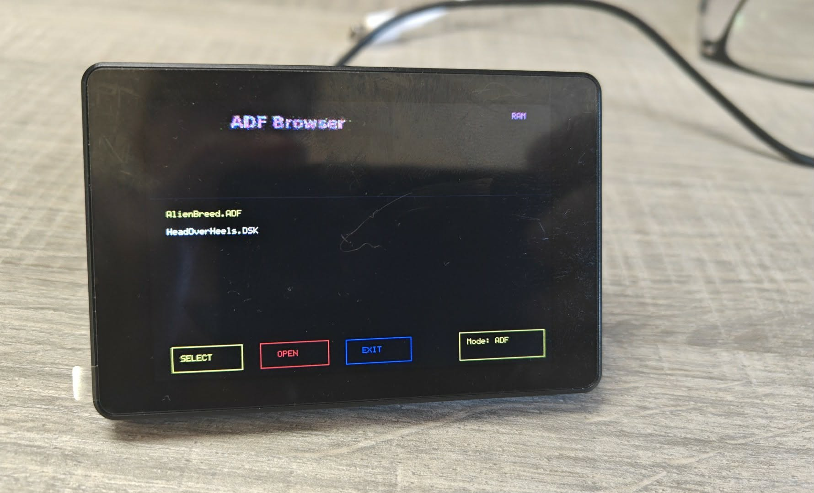

# Gotek Touchscreen Interface

A touchscreen-driven disk image browser for retro computing. Load Amiga ADF and ZX Spectrum/Amstrad CPC DSK files from an SD card onto a USB-presentable RAM drive — with cover art, game info, multi-disk support, and themeable UI.



## Supported Hardware

| Display | Controller | Resolution | Touch | Status |
|---------|-----------|------------|-------|--------|
| **Guition JC3248W535C** | AXS15231B (QSPI DBI) | 480×320 (landscape) | I2C capacitive | ✅ Full support |
| **Waveshare ESP32-S3-Touch-LCD-2.8** | ST7789 (SPI) | 320×240 | I2C capacitive | ✅ Full support |

Both boards use an **ESP32-S3** with PSRAM and an SD card slot.

## Features

- **Game browser** — Scrollable list with thumbnail cover art and game names
- **Detail view** — Full-size cover art, game info from `.nfo` files, tap to insert/eject
- **Multi-disk support** — Games with multiple disks are grouped automatically; switch disks from the detail view
- **USB Mass Storage** — The ESP32 presents a FAT12 RAM disk over USB, so retro machines see a standard floppy drive
- **Themeable UI** — Three built-in themes (Amiga WB2, Cyberpunk, Steampunk) with PNG button assets; create your own
- **Auto-resume** — The last loaded disk and theme are saved to `CONFIG.TXT` and restored on boot
- **ADF/DSK modes** — Switch between Amiga (ADF) and ZX/CPC (DSK) disk formats from the info screen

## Themes

Themes are folders inside `/THEMES/` on the SD card containing PNG button images. Three themes are included:

**Amiga Workbench 2.x**


**Cyberpunk**


**Steampunk**


To create a custom theme, make a new folder in `/THEMES/` and add these PNG files (32-bit RGBA with transparency, or 24-bit RGB):

| File | Size | Used on |
|------|------|---------|
| `BTN_BACK.png` | 148×36 | Info & Detail pages |
| `BTN_THEME.png` | 148×36 | Info page |
| `BTN_ADF.png` | 148×36 | Info page |
| `BTN_DSK.png` | 148×36 | Info page |
| `BTN_LOAD.png` | 148×36 | Detail page (INSERT) |
| `BTN_UNLOAD.png` | 148×36 | Detail page (EJECT) |
| `BTN_INFO.png` | 44×36 | List page |
| `BTN_UP.png` | 44×133 | List page (scroll up) |
| `BTN_DOWN.png` | 44×133 | List page (scroll down) |

Missing PNGs fall back to simple drawn buttons, so you don't need to provide all of them.

## SD Card Layout

```
SD Card Root/
├── CONFIG.TXT              # Auto-generated config file
├── THEMES/
│   ├── AMIGA_WB2/          # Theme folders with PNG button assets
│   ├── CYBERPUNK/
│   └── STEAMPUNK/
└── adfs/                   # Disk images (ADF mode)
    ├── Speedball 2/
    │   ├── Speedball 2.adf       # Single-disk game
    │   ├── Speedball 2.jpg       # Cover art (JPEG)
    │   └── Speedball 2.nfo       # Game info (plain text)
    ├── Cannon Fodder/
    │   ├── Cannon Fodder-1.adf   # Multi-disk: use -1, -2, -3 suffix
    │   ├── Cannon Fodder-2.adf
    │   ├── Cannon Fodder-3.adf
    │   ├── Cannon Fodder.jpg
    │   └── Cannon Fodder.nfo
    └── ...
```

The `sdcard_example/` folder in this repository contains a ready-to-use SD card structure with three example games (empty `.adf` placeholder files, real cover art and `.nfo` files).

### File naming conventions

- **Single-disk games**: `GameName.adf`
- **Multi-disk games**: `GameName-1.adf`, `GameName-2.adf`, etc.
- **Cover art**: `GameName.jpg` (JPEG, any resolution — displayed scaled to fit)
- **Game info**: `GameName.nfo` (plain text, line 1 = title, line 2 = description)
- **DSK mode**: Same structure but with `.dsk` files in a `dsks/` folder

## Building

### Requirements

- [Arduino IDE](https://www.arduino.cc/en/software) 2.x or later
- ESP32 board support package (via Board Manager)
- Required libraries: `JPEGDEC`, `PNGdec` (via Library Manager)

### Arduino IDE Settings

| Setting | Value |
|---------|-------|
| Board | ESP32S3 Dev Module |
| USB CDC On Boot | Enabled |
| PSRAM | OPI PSRAM |
| Flash Size | 16MB (128Mbit) |
| Partition Scheme | Huge APP (3MB No OTA / 1MB SPIFFS) |

### Display Selection

The firmware supports both display types in a single sketch. Edit the `ACTIVE_DISPLAY` define near the top of `Gotek_Touchscreen.ino`:

```cpp
#define ACTIVE_DISPLAY DISPLAY_JC3248      // Guition JC3248W535C
// #define ACTIVE_DISPLAY DISPLAY_WAVESHARE  // Waveshare 2.8" LCD
```

### Upload

1. Connect the ESP32-S3 via USB
2. Select the correct COM port in Arduino IDE
3. Click Upload
4. Insert the prepared SD card and power on

## Configuration

The `CONFIG.TXT` file is created automatically on first run and updated when you load a disk or switch themes. You can also edit it manually:

```ini
DISPLAY=JC3248
LASTMODE=ADF
THEME=AMIGA_WB2
LASTFILE=Cannon Fodder-1.adf
```

See the included `CONFIG.TXT` for all available options and documentation.

## Repository Branches

| Branch | Target device | Description |
|--------|--------------|-------------|
| **`master`** | JC3248W535C touchscreen | ✅ Main development branch — latest refactored firmware |
| **`wifi-dongle`** | Gotek WiFi Dongle (headless) | ✅ Headless dongle firmware — same shared/ library as master |
| `main` | JC3248W535C | Legacy branch with earlier PR merges — superseded by master |
| `clean-main` | JC3248W535C | Clean baseline snapshot — archived, not maintained |

**For normal use, always flash from `master` (touchscreen) or `wifi-dongle` (dongle).**

## Architecture

The firmware is split into device-specific sketches and a shared library:

```
JC3248W535EN/
├── Gotek_Touchscreen/          # JC3248 touchscreen firmware
│   ├── Gotek_Touchscreen.ino   # Main sketch — display, touch, USB MSC
│   ├── api_handlers.h          # JC3248-specific HTTP API handlers
│   ├── webserver.h             # WiFi AP + HTTP router
│   ├── ftp_client.h            # FTP client
│   ├── webdav_client.h         # WebDAV client
│   └── webui.h                 # Embedded web UI (gzipped)
├── Gotek_WiFi_Dongle/          # Headless WiFi dongle firmware
│   └── Gotek_WiFi_Dongle.ino   # Main sketch — PSRAM RAM disk, SPIFFS
└── shared/                     # Shared library (both devices)
    ├── http_utils.h            # JSON escape, HTTP responses, request parser
    ├── log_buffer.h            # 4096-byte ring buffer for serial log
    ├── dav_folder_cache.h      # Persistent folder listing cache (SD or SPIFFS)
    ├── connectivity_api.h      # FTP, DAV, WiFi, config GET/POST handlers
    └── README.md               # Shared library architecture docs
```

Each device selects its storage backend and enables optional features via preprocessor defines in its `.ino`:

| Define | JC3248 | Dongle | Effect |
|--------|--------|--------|--------|
| `DEVICE_JC3248` | ✅ | — | Enables SD/display-specific code paths |
| `DEVICE_WIFI_DONGLE` | — | ✅ | Enables PSRAM/SPIFFS-specific code paths |
| `DEVICE_HAS_SD_COVER_CACHE` | ✅ | — | Cover art cached on SD card |
| `DAV_CACHE_FS` | `SD_MMC` | `SPIFFS` | Storage backend for folder cache |
| `DAV_CACHE_FS_IS_SPIFFS` | — | ✅ | Flat-namespace path generation for SPIFFS |

Key components:

- **Display abstraction** — `gfx_*` API wraps QSPI DBI (JC3248) and SPI (Waveshare) behind a common framebuffer interface
- **Touch handling** — I2C capacitive touch with coordinate validation, release-based tap detection, and swipe support
- **USB Mass Storage** — FAT12 filesystem emulation in PSRAM, presented as a USB floppy drive
- **Theme engine** — PNG buttons with alpha blending, loaded from SD card at runtime
- **Game grouping** — Multi-disk games automatically grouped by name prefix into single list entries
- **WebDAV / FTP** — Remote disk image browsing with persistent folder cache for instant repeat opens
- **Web UI** — Browser-based config and file manager served from PROGMEM (gzipped)

## Contributing

Contributions are welcome! This project is a fork of [mesarim/Gotek-Touchscreen-interface](https://github.com/mesarim/Gotek-Touchscreen-interface).

If you'd like to contribute, please open an issue first to discuss what you'd like to change, or submit a pull request directly.

## License

MIT — see [LICENSE](LICENSE) for details.
